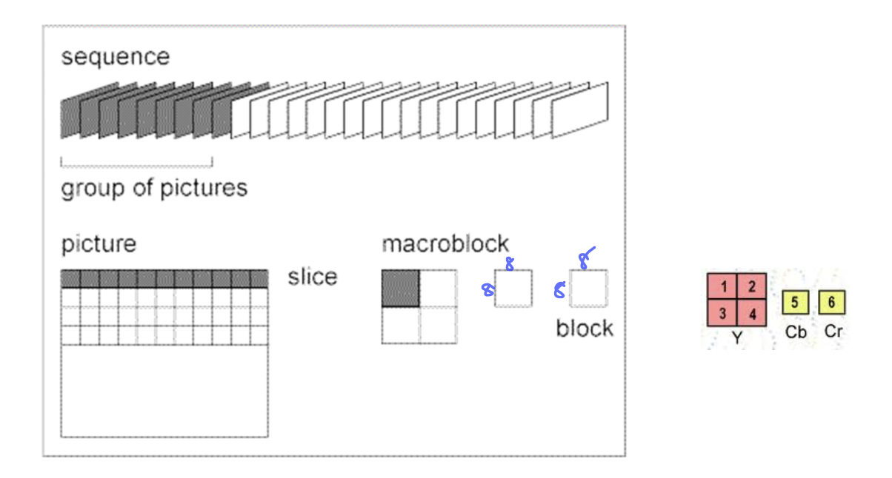
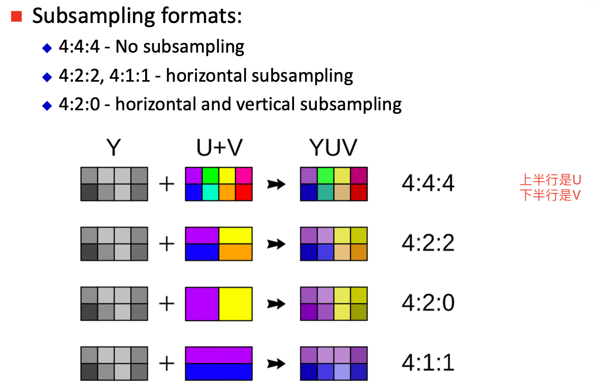
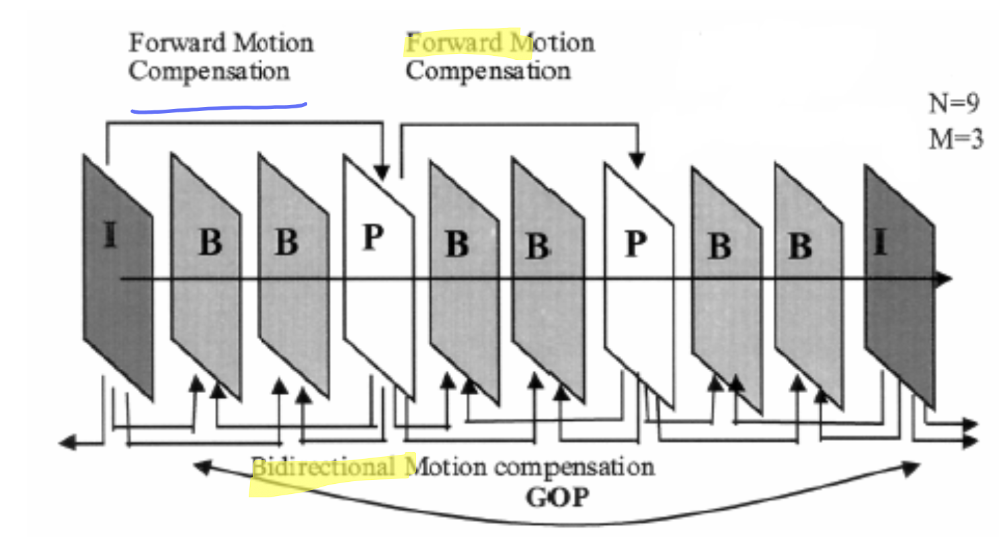
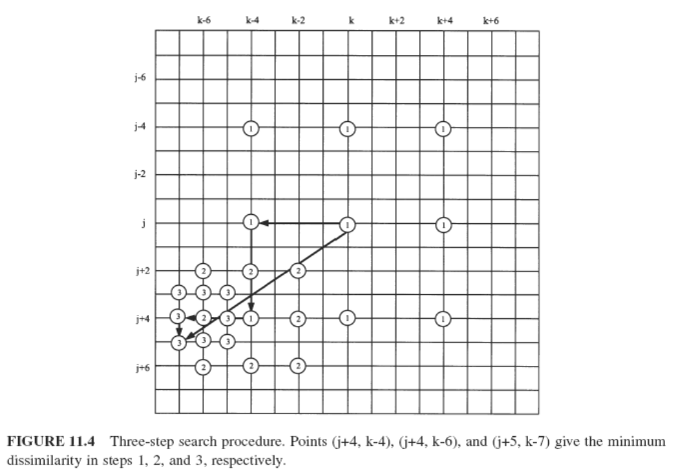
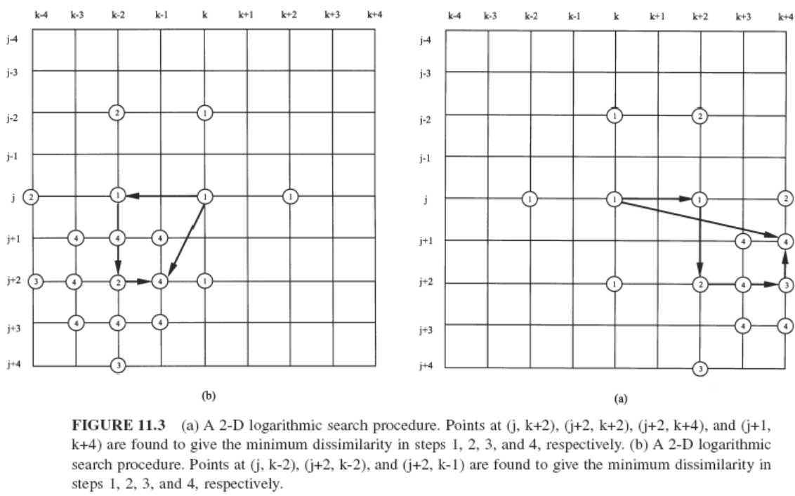
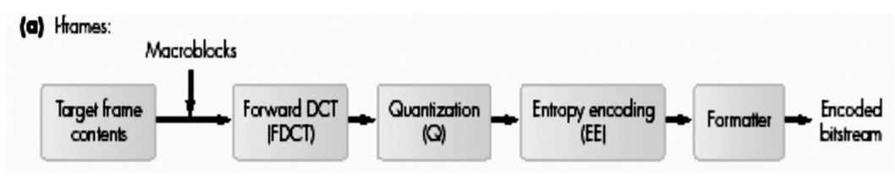
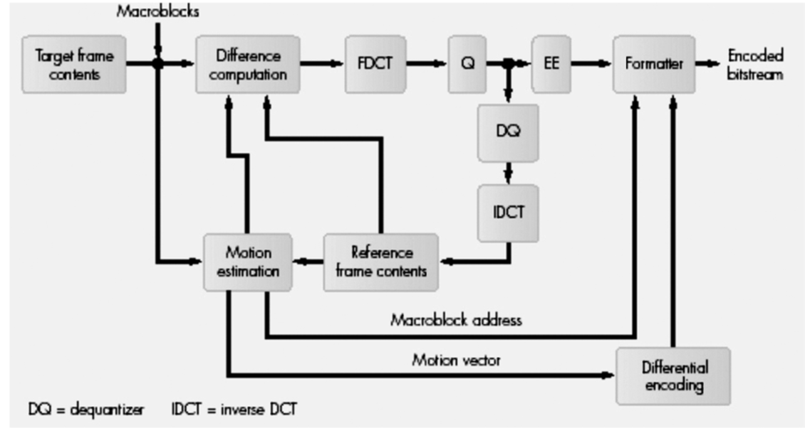
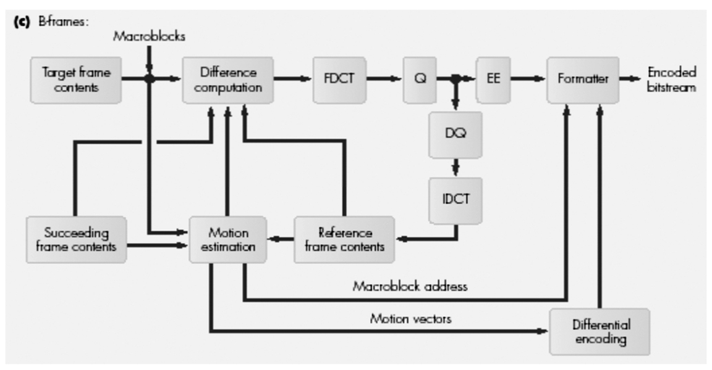

## Video Compression  视频压缩技术

视频压缩技术主要是为了在保证视频质量（即不影响人类观感）的情况下，尽可能的减少其所占的内存。

视频的结构可以如下图所示：一个完整的视频由连续的frame组成。

根据图像和视频的特性可知，压缩主要是压缩其冗余的部分，主要包含以下三部分：

- 空间冗余，spatial redundancy. 主要描述的是图片中的像素点与其邻近的像素点具有很多相似的部分，可以有选择性的压缩一部分
- 时间冗余，temporal redundancy. 主要描述的是在视频的连续frame中存在大量相似的部分，也可以压缩一部分
- 视觉冗余，psycho-visual redundancy. 主要描述人眼对于亮度更加敏感，对于颜色和高频的信息不敏感，也可以压缩一部分

综上，视频的压缩主要是压缩以上三种冗余。通过压缩静态frame的spatial 和 psycho-visual redundancy 和 通过motion estimation, motion compensation压缩temporal redundancy.

#### 基本知识

- 分辨率
- 扫描类型：

  - interlace: 逐行扫描
  - progressive：连续扫描
- 颜色空间下采样

  

#### MPEG

MPEG 的GOP包含三类frame, I-frame, B-frame, P-frame

- I frame, 作为参考frame，压缩办法采用JPEG的方法
- P frame，只与前一个reference frame(I 或者B) 对比 motion estimation / compensation
- B frame，与前后的reference frame做对比
- B frame 的压缩比最大，信息损失的最多

其中GOP包含两个参数：

- N： GOP合计包含的frame 数量
- M：两个reference frame之间的数量
- N M 越大，B frame 和 P frame越多，压缩比越大，信息的错误可能会越多，图像的质量越差，但是是占用内存更小，效率更高

**Motion Estimation**

寻找到与当前处理的像素点最相近的元素，motion vector 为reference 指向 current 处理的方向。具体找到相似的像素点包含以下三个方法：

- 全查找
  在搜寻的窗口下，每个点对比。

  - 优点：精确而且具有最好的压缩比
  - 缺点：计算慢，需要大量的计算成本
- 三步查找
  

  - 优点：计算快
  - 缺点：没有全查找准确，压缩比低
- 2D 对数查找

  

  - 如果误差最小的点为中心点或者在边界，则将search window缩小一半
  - 如果search window 为3*3，寻找9个点
  - 速度、准确性以及压缩比都介于全查找和三步查找中间

**I-frame encoding**

**P-frame encoding**

motion estimation 找到误差最小用的公式是 sum of absolute difference(SAD)

如果没找到相似的macroblock，则采用和I-frame相同的encoder 方式。

**B-frame encoding**

#### MPEG 标准的演进

MPEG-1 只支持non-interlaced video, 4:2:0 chroma 下采样

- JPEG 压缩比为10:1

MPEG-2 在MPEG-1的基础上支持scalable coding，支持interlaced video, 支持更高质量的视频。重点介绍一下scalable coding。大概压缩比为30:1

- scalable coding 包含一个base layer 以及多个enhancement layer
  - base layer 可以独立的编解码，以及传输保持基本的视频质量
  - enhancement layer 的编解码依赖于base layer 或者之前的enhancement layer。主要是用于提升视频的质量
- scalable coding 包含以下部分：
  - SNR scalability
  - Spatial scalability
  - Temporal scalability
  - Hybrid scalability: 包含以上的两种
  - Data Partitioning
    - lower AC coefficients 用于编码base layer， higher AC coefficients 用于编码enhancement layer

H.264 大概压缩比为50:1
