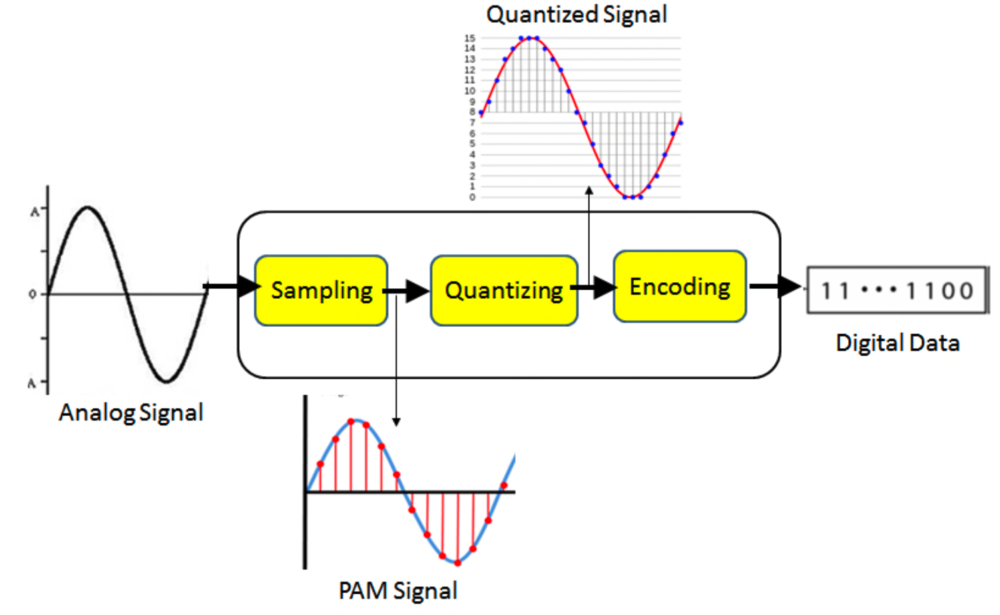
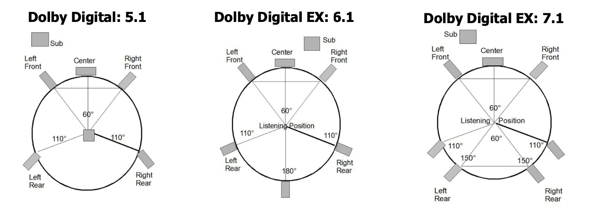
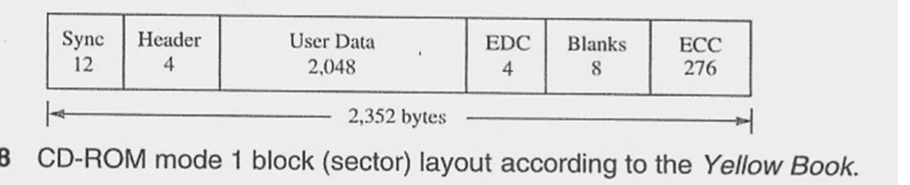
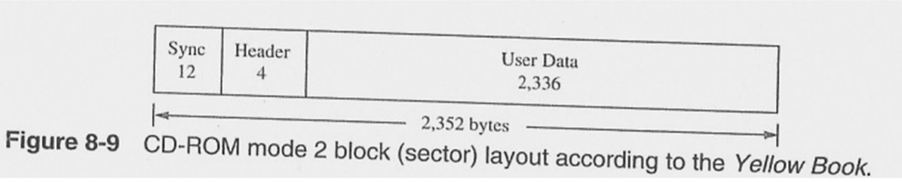
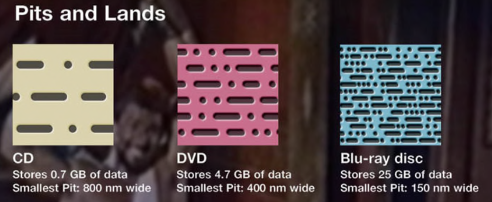
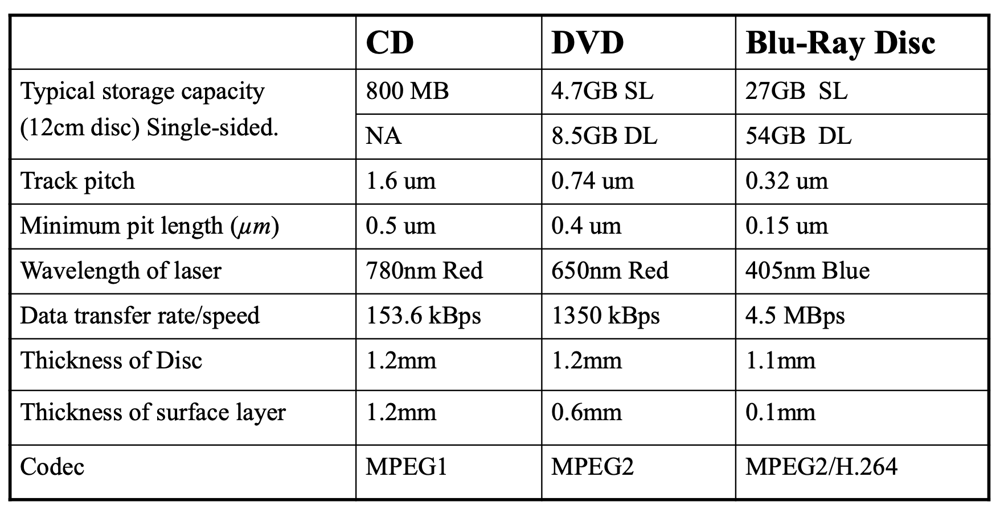

#### Audio

自然界的音频信号本质上是模拟的，即声波在自然界中以连续变化的波存在。

但是模拟音频主要存在两个问题：

- 数据保真度，在复制和重放的过程中，信号的质量都会降低
- 耐久性退化，存储的介质（如磁带、黑胶唱片）会随着时间推移而退化

相比，数字音频具有显著的的优势

- 更宽的动态范围，可以表现更大的音量变化范围
- 更强的抗噪能力，对环境噪声和传输干扰具有更强的抵抗力
- 精确的复制能力，可以无损的进行复制，不会造成质量的下降
- 更高的耐久性
- 便于编辑，传输、分发和存储
- 错误校正，可以检测并修复传输过程中出现的错误

音频信号包含两类：语音和音乐

模拟信号转化为数字信号：

其中，

- 语音信号的频率范围为50-10kHz, 采样率应大于20kHz.量化位深为12bits/样本
- 音乐信号的频率范围为25-20kHz,采样率应大于40kHz。量化位深为16bits/样本
- 量化位深指的是每个音频样本可以记录的振幅值数量，记录的越多，越能准确的复现原始信号。
- 位深和采样率分别处理声音的垂直和水平维度。位深决定每个样本的精细程度，采样率决定每秒捕捉样本的频率。

**Nyquist 采样定理**

若连续信号可以被完美的采样和重建，则采样频率至少为信号最高频率分量的2倍。即Nyquist rate = $2f_{max}$
- 如果采样频率低于 $2f_{max}$，则会发生信号混叠
  当信号的采样率不足时，高频信号会被错误的当成低频信号，导致信号失真。出现幽灵音或者回声
- 可采用低通滤波器限制高频内容，使其成为带限信号

**PCM 脉冲调制技术**
- PSTN 公共交换电话网的带宽范围为200-3.4kHz
- 采样频率为8kHz，略高于6.8kHz
- 位深为8bits, 可记录256个不同的幅值

**不同类型的音频文件格式**
- 未压缩格式：WAV, AIFF
- 无损压缩：FLAC，ALAC，MPEG-4，WMA lossless
- 有损压缩：MP3，AAC，WMA lossy

**MP3**
MP3 是MPEG-1 或者 MPEG-2 的音频层3。由MPEG设计开发的
- 基本理念是：利用感知编码（心理声学模型）近似处理超出大多数人听觉分辨能力的部分
  - 利用掩蔽效应：当一个响亮的声音出现时，它会掩蔽附近频率的较弱声音。MP3利用这个特性，有选择的丢弃一部分信号。
- 典型的压缩比从4:1 到 20:1

**Dolby Digital**
杜比数字是一种行业标准的环绕声音编解码器，设计用于提供5.1声道的音频
- 5 代表5个独立的声道，左前、右前、左环绕、右环绕以及一个中置前声道
- .1 代表一个独立的低频效果声道

通过感知编码，移除人耳无法听到的音频信息并压缩剩余数据，实现高效存储和传输

**Dolby Digital EX**
在标准的5.1声道的基础上，增加后环绕声道。
- 6.1 后环绕通过一个单独的后中置环绕声道
- 7.1 两个额外的声道，后左和后右

**Dolby Atoms 杜比全景声**
主要应用于电影院和家庭影院，与DTS:X竞争
- 增加高度扬声器，可以通过向上发生的扬声器替代
- 将声音视为对象而非声道，将声音分配到空间位置而非特定的声道
- 可随扬声器的数量自由扩展

#### 存储

传统的存储介质是硬盘，磁带，容易损坏和磨损，以及退磁
现在的光学存储介质：CD-DA, VCD, 蓝光，较低成本存储而且很便捷
- 螺旋形的轨道存储数据
  - 螺旋形的轨道允许激光头在读取数据时以恒定的线速度移动，保证数据流的稳定性。而且节省空间。
  - 数据以pits and lands(凹坑和平坦区域)的形式编码在轨道上，通过读取反射光强度解码数据

**CD-ROM**

只读数据。由sony 和 philips 联合开发

- CD-ROM1 用于计算机数据存储，容量为650M, 每秒读取150KB的数据。具有纠错能力
  
  - EDC 错误检测码，检测数据存储和传输中是否发生错误
  - blank 保留字段，用于格式化或者未来拓展
  - ECC 错误校正码，用于修复可能发生的错误
- CD-ROM2 用于存储多媒体，容量为741M，每秒读取175kb的数据，无纠错能力
  

**VCD**
在光盘上存储视频的标准格式，120mm的光盘上，较低的成本分发

- codec:基于MPEG-1 编解码
- 容量：单层4.7G

**DVD**

- codec: 基于MPEG-2 编解码
- DVD 通过使用更小的pits实现更高的数据存储容量，提高了轨道的密度
  

**Blu-ray Disc 蓝光**
高密度的磁盘，用于数据存储以及高分辨率的游戏和视频
- codec： 支持MPEG-2，H.264， VC-1
- 容量：单层25G，双层50G
  

**Flash Memory**

闪存式一种电可擦除可编程的只读存储器 EEPROM
- 存储卡，U 盘
- 静音，更小尺寸，更轻，无机械部件，传输更灵活