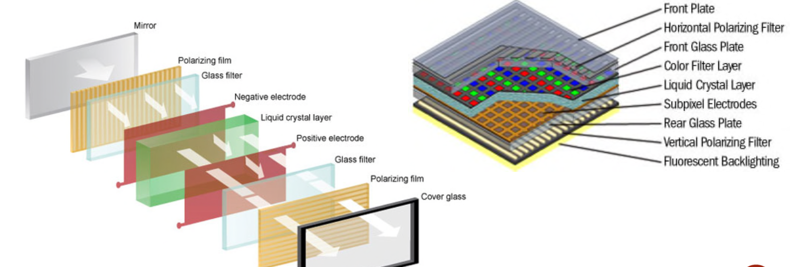

#### Media streaming

流媒体是一种现代化的内容分发技术，允许用户在数据传输的过程中即时访问和播放内容，无需先下载完整文件。

流媒体的流行主要依赖于：
- 更快的网络速度
- 更好的压缩技术
- 消费者的接受度

#### TV display

平板电视的显示技术类型：
- 等离子 Plasma
- 液晶显示器 LCD
- 发光二极管 LED
- 有机发光二极管 OLED

**等离子电视**

每一个子像素是一个微小的荧光灯，可以发出红、绿或者蓝三种基本颜色。通过调节这三种子像素的亮度，进而显示多种颜色。

在密封的单元中电压刺激惰性气体（氖气和氙气），使其变成等离子体，并且发出彩色光。

实现原理：
- 当施加电压时，电子从气体中剥离，形成等离子体
- 当电压停止时，电子与等离子体重新结合，恢复为气体状态，同时释放紫外线光子
- 紫外线辐射激发单元内的荧光涂层，从而产生可见光
- 实际使用的时候，电压的施加是脉冲式施加的

**LCD液晶显示器电视**

LCD 通过背光源发出的光通过一系列的偏光滤镜、电极和微小液晶单元组成的矩阵来工作。每个子像素上的不同电压控制通过的光量，进而显示不同的颜色。

- 背光源提供均匀的白色背景光，只提供光源
- 水平和垂直的偏光滤镜控制光线的偏振方向，未经调节的背光会完全被阻挡
- 液晶层，会在电场的作用下改变排列的方向，控制通过的光量。电压越高，液晶分子越整齐，通过的光量越少。只控制光的透过量
- 彩色滤镜层，为每个子像素提供RGB，通过调节亮度实现全彩展示
  

简单理解：液晶本身只是“调光阀门”，控制白光是否能通过，而颜色是由彩色滤光片决定的。LCD 是利用光的偏振原理+电场控制液晶分子排列，从而控制每个像素的亮度和颜色。

**LED**

LCD的改进版本，使用LED阵列替代传统LCD的冷阴极荧光灯（CCFL）背光源

相比于传统的荧光灯：
- LED 阵列可以单独控制亮度，可以局部调光。使对比度和黑色的表现力更强
- 功耗更低

**OLED**

OLED 是一种自发光显示技术，发光层由有机化合物薄膜组成，通电后会释放能量产生光，无需额外的背光源。

相比于LED:
- 无需背光源，OLED像素本身发光
- 可以独立控制每个像素，可以显示真正的黑色，实现高对比度
- 更快的刷新率
- 更低的能耗

**3D TV**
通过左右眼分别显示不同的图像视角，欺骗大脑，使其以为具有深度

- 有眼镜的3D系统
  - 被动式眼镜：
    - 红蓝眼镜（色差进行图片分离）
    - 偏振眼镜（不同的方向的偏振光），不会扭曲色彩，可以提供一个更好的体验。使用水平偏振条纹覆盖在屏幕上，这些条纹在每一行之间交替设置不同的偏振方向，从而可使用成本较低的3D被动式眼镜。
  - 主动的快门眼镜
    使用小型的LCD屏幕，与电视中的红外信号发射器同步，交替快速显示左右眼图像，进而产生深度感。
  - 对比
    - 偏振眼镜成本低，不需要额外的电池充电，不需要与显示屏同步的发射器，没有闪烁或者重影的问题。但是分辨率仅为快门的一半。
- 无眼镜的3D系统
  - 裸眼3D
    - 视差障碍条，屏幕前加一层遮挡条，使左右眼只能看到各自的视角
    - 柱状幽静：透镜阵列，使不同角度看到不同的图像